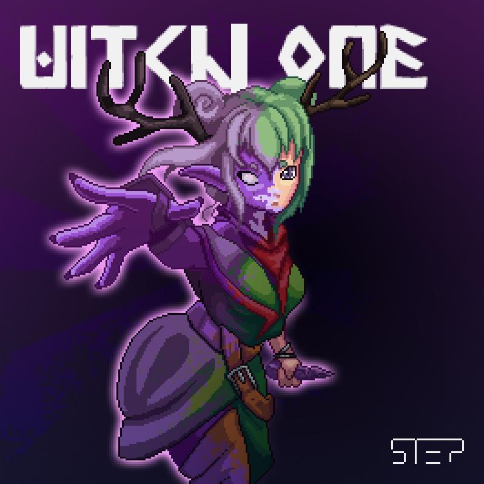
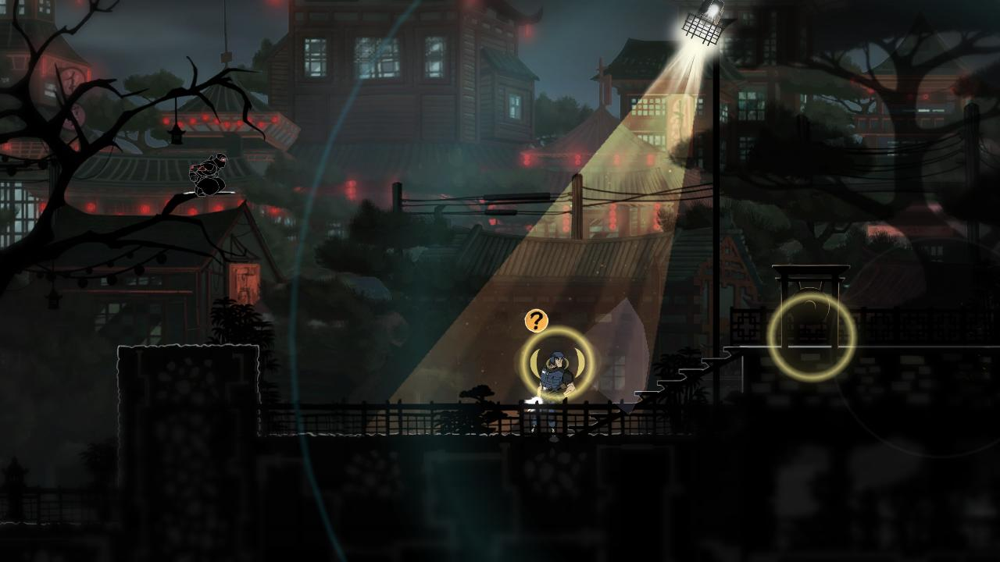

# Introduction


## Disclaimer

This document will incrementally record the game’s development status and change any of the contents depending on how the team thinks of the project. Because of this, some of the content in this document may be outdated from what the team will do with the project.

Everything written here is subject to change with each improvement coming to the project, and by no means it’s comprehensive.

For developer reference docs, please check our [developer reference guide](https://devdocs.witchone.io/) page.



## Supporting the Team

Please consider following our team's Twitter account if you are interested in this project and want to hear more from us.

For people who want to support this project directly or are interested in joining the team, please send us your portfolio to `info@teamstep.io`. Alternatively, you can refer to our [Patreon page](https://www.patreon.com/teamstep) to support our team!


## Project Description

<figure><figcaption></figcaption></figure>

**Witch One** (internal project alias: `Catch.io`) will be an indie online stealth-focused rotative asymmetric hide-and-seek game. The game is set in a medieval fantasy world full of history. The game's objective is to hide away or kill other players and become the last player alive in a stealthy environment.

At the start of the game, one random player will be chosen as the "Cursed One," who must kill a player without being caught. The Cursed One will be invisible to the players, but they cannot use any items, while other players can use items to trap or run away from the Cursed One. The Cursed One can still leave footprints and generate sound waves if they are not careful where they step. In this game, the Cursed One must kill a player within the countdown, while other players must survive. If the Cursed One kills someone, the game chooses a different player to be the next Cursed One while the killed player gets the game over. This loop will repeat until only one player is left in the game, hence the battle-royal aspect.

Witch One can be broken down into the following game mechanics:

* Melee attack
* Health & stamina
* Throwable items
* Consumable items
* Footprints
* Footsteps & sound waves
* FOV & dynamic lights
* Cursed One

Witch One puts the player in a dark environment where every movement will announce your location or allow others to look at your tracks to find you.

Certain surfaces in the game can leave a footprint when the player walks on top of it. This footprint will be in the game until the player gets the game over. Depending on your movement state, such as running or walking, your movement can generate a visible sound wave that is visible to players.

But you can also use the tools and items scattered worldwide. You can throw a rock to create a sound wave, use a teleport rune to escape from sticky situations, or make a sticky situation by throwing a slime egg, creating a slimy surface that will slow down anyone on top.

The items scattered throughout the map can help the player weaken or trap other players, but none will be strong enough to kill another player in one hit. Furthermore, every movement the player makes will create a visual soundwave that is visible to other players. Certain surfaces will emit a visible sound wave or leave a footprint that will last until that player is out of the game. A match will consist of 10 \~ 15 players randomly spawned at a fixed location. Predefined spawn points ensure that no players will ever see each other at the beginning of the game. Players are only given 6 item slots (with no item stacking) and will not start with any items.

The overall visual theme will take inspiration from a typical medieval fantasy setting, but the characters will be based on witches and sorceresses throughout different cultures. Players can choose from a set of classes with visuals that fit these aesthetics, and the map will also have the same feel. The game currently does not have any magic or skills, but we plan to add one-time magic items in a later update if it adds to the gameplay.

* No account base items (no login required to play if possible)
* No pay-to-win items
* No crunch
* Players are encouraged to hide
* Certain surfaces will generate a visible sound wave or footprints
* Only the player’s K/D stats are recorded on the server
