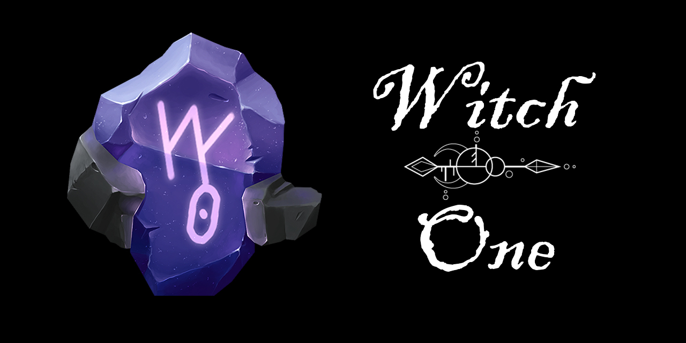

# Introduction


## Disclaimer

This document will incrementally record the game’s development status and will change any of the contents depending on how the team thinks of the project. Because of this, some of the content in this document may be outdated from what the team will actually do with the project.

Everything written here is subject to change with each improvement coming to the project and by no means it’s comprehensive.

For developer reference docs, please check our [developer reference guide](https://devdocs.witchone.io/) page.



## Supporting the Team

If you are interested in this project and want to hear more from us, please consider following our team's [Twitter account](https://twitter.com/teamstepgames).

For people who want to directly support this project or are interested in joining the team, please send us your portfolio to info@teamstep.io, alternatively, you can refer to our [Patreon page](https://www.patreon.com/teamstep) to support our team!


## Project Description

**Witch One** \(internal project alias: `Catch.io`\) is an online stealth-focused battle-royale-style deathmatch. The objective of the game is to be the last player standing by using the elements provided to you on the map.

This project was inspired by popular battle royale games like PUBG or Fortnite. However, this game focuses on stealthy gameplay and strategy rather than action. There are no guns or ranged weapons that can kill the other player. Instead, players can only kill another player with a fatal melee attack. There will be items and tools that support the player throughout the world map. The game is designed so that the player has to hide and sneak up to the other player, be aware of their surroundings, as every movement and action the player makes will alert your location to others.

Witch One can be broken down into the following game mechanics:

* Melee attack
* Soul-meter
* Throwable items
* Consumable items
* Footprints
* Footstep & sound waves
* FOV & dynamic lights

The items scattered throughout the map can help the player to incapacitate or trap other players, but none of them will be strong enough to kill another player. Furthermore, every movement that the player makes will create a visual soundwave that is visible to other players. Certain surfaces will leave a footprint that will last until that player is out of the game. And other environmental indicators like an open door or fallen stacks of books to announce your presence.

The game starts by randomly spawning players of 10 ~ 15 within a fixed spawn point. Predefined spawn points are used to ensure that no players will ever see each other at the very beginning of the game. Players are only given 6 item slots \(with no item stacking\), and they will not start with any items.

Players will have to be aware of two status values, sanity, and stamina. Stamina will decrease by a certain amount every 5 seconds. When your stamina hits 0, your sanity value will start to drop. And after a certain threshold in your sanity value, you will begin to see soundwaves coming from random places, and your vision will get darker. Players can only catch another player whose sanity level is below a certain amount. Attempting to catch a player with a high sanity value will only push them backward and decrease their sanity and stamina value by a considerable amount. From here, both players are given a tiny window of opportunity to either run away or try to catch them again.

The development will be done through _Unity 2021.1.19_ and it will stay there until released. The engine version can change if there is a critical bug that the later version addresses.

The overall visual theme will take inspiration from those of a typical medieval fantasy setting but the characters will be based on witches and sorceresses throughout different cultures. Players can choose from a set of classes with visuals that fit these aesthetics and the map will also have the same feel to it. The game currently does not have any magic or skills, but we are planning on adding one-time magic items in a later update if it adds to the gameplay.

* No account base items \(no login required to play if possible\)
* No pay-to-win items
* Players are encouraged to hide
* Certain surfaces will generate a visible sound wave or footprints
* Only the player’s K/D stats are recorded on the server

