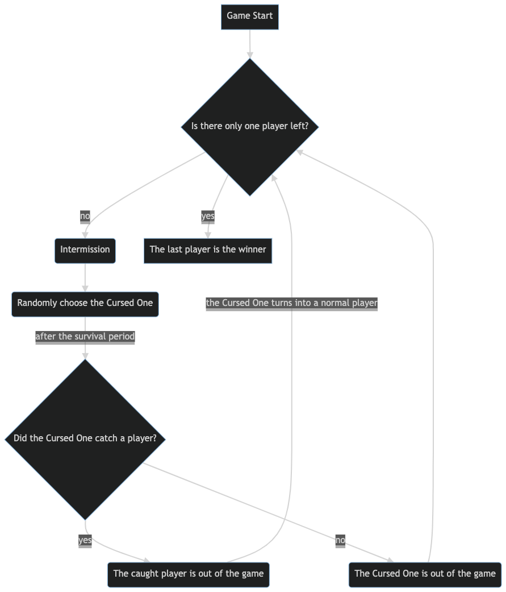

# Game Design and Balancing

## Gameplay Loop

The following is the general condition for choosing the winner from a system perspective.

In this chart, there are two timeframes the player must be aware of:

* Intermission: the `intermission` is the time between a new Cursed One is chosen. This will be 100 seconds for the first round, and 30 seconds for all proceeding rounds. During this time, the players will be looking for a hiding spot or collecting items on the map.
* Survival period: the `survival period` is the time frame in which the Cursed One must catch another player. If the Cursed One fails to catch someone within the countdown, that player will get a game over and a new Cursed One will be chosen. The length of the survival period has a negative relationship with the number of players that are currently in the game (i.e., fewer players are in the game, the longer the survival period will be).

The game map contains various items that allow the player to trap others, escape from others, or deal heavy damage. Potions will have a very important role as they can save a player from the Cursed One's attack that is not a backstab. These items can be used by the Cursed One, and because the game is designed so that every player will become the Cursed One at least once, some may want to prepare themselves just in case they're the next Cursed One.

Players are expected to move around the map to find these items while hiding from the Cursed One (or searching for other players if the player is the Cursed One).

## Expected Playstyles and Strategies

Witch One will have a large and replayable stage such as the ones that can be seen in a typical Battle Royal type game. The map will have hiding spots and items that most players will be interested in while they try to survive or kill.

Normal players will only know that the Cursed One has been chosen, but will not know who the Cursed One is. This means that the Cursed One can blend in with other players and wait for the perfect moment to kill them. Furthermore, _the game will only choose the Cursed One from a pool of player who has not been chosen as the Cursed One. This pool will reset if all the players that are currently in the game have been chosen as the Cursed One already_. This means that if you have been a Cursed One before or you know a player has been a Cursed One before, you can count on the fact that they won't be chosen as the next Cursed One for a while.

Players will be able to show the following behaviors:

1. Paranoia - Players don't know who is the Cursed One, so when they encounter another player in the game, they will be cautious about getting close to her. The simplest strategy would be to completely hide.
2. Cooperation - Other than a clean backstab, the Cursed One can be killed instantly when two players attack her at the same time. Therefore, it is safe for players to stick in pairs of three so that if one player becomes the Cursed One, they can quickly react or at least one player can survive and escape.
3. Looking for vulnerable players - Because the Cursed One has a slower running speed than normal players, it's better for that player to blend as a normal player and search for someone who is alone. Pretend like you're also hiding from the Cursed One and when the timing is right, stab her in the back.

## Stage Designing

### Map Layout and Areas

Witch One will have an open map that consists of multiple areas that are connected to each other. There will be player spawn areas that will spawn up to 5 players in a single region.

Map biomes include:

* Forest
* Flora plain
* Campsite
* Towns or Villages
* Cave or Dungeon
* Castle
* Old Ruins
* Swamp
* Snow

A single map must contain at least five areas listed above. The map designer can focus on creating each area in a block for specific themes and biomes and combine the areas together like a puzzle to create a single large map. Furthermore, the map should always contain at least 3 hiding spots or buildings in a single area as those places will be the main interset of the player.

With enough design variations, we can also create a semi-procedural map-generating algorithm that places these areas together randomly for each session. _But that is not part of our development schedule at the moment_.

### Map Throwable Object Layout Guidelines

A single map should contain at least 60 throwable items and these should be perceived as rare to the players. Most items will be randomized in a large location, but some spots will require the map designer to manually place a random item generator for balance.

Unlike other collectible items, potions have a spawn point that will ensure that there will always be at least 5 potions on the map.
