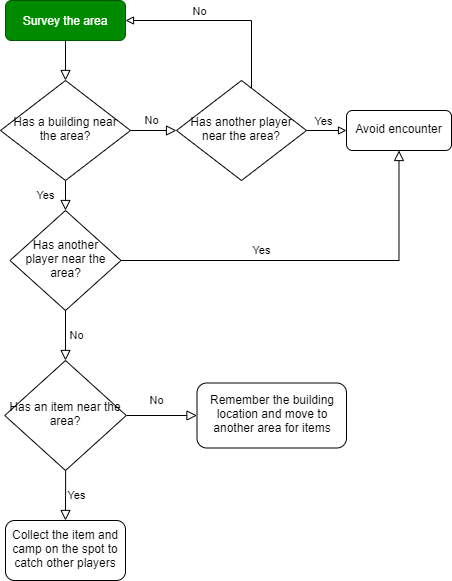
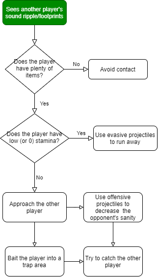

# Game Design and Balancing

## Gameplay Flow

We want the player to have the following gameplay flow in order for the game mechanics to function properly.

We can sum up the player's behavior based on the following condition:

* Low stamina/sanity -&gt; move around the map to find potions and avoid contact from other players.
* No items in inventory -&gt; move to another area in search of items
* Has a balanced item sets in inventory \(one evasive, one offensive, and one healing item\) -&gt; search for other players or set up a camping spot to lure other players

In short, we want the players to keep on moving around the map while keeping them on their toes for other players. This also means that we want the players to make their every movement a strategy of its own.

## Expected Playstyles and Player Types

Witch One will have a large and replayable stage such as the ones that can be seen in a typical Battle Royal type game. The balance of the game is mostly determined from this aspect.

We expect the following play styles the players can have

* Aggressive - these players will charge directly to other players and try to catch them. They do not hide or use any throwable objects. They do not form a strategy when approaching another player, they just go into the action.
* Stealth - these players will try to use throwable objects or hide from other players. Most likely they will wait for other players to fight each other rather than joining the fight themselves.
* Neutral - players who are sometimes aggressive and sometimes stealthy. They will try to attack other players when given the chance, but they will also try to use most things they can find inside the game. However, once these players find a dominant strategy, they will only use that and nothing else, making them potentially aggressive players.

**We want more stealth or neutral players and reduce the number of aggressive players.**

Why? Because these players will not make the game fun for others \(the game will end shortly for the victim\) and it also proves that the game mechanics are not working well with the players. We must disincentivize aggressive playstyles.

### Nudging Players

These are some of the key factors that game designers should know before adding a mechanic to the core game or placing an object on the map. These should nudge the players into using the strategy that we want them to use.

* Being seen \(being inside the light\) means someone will chase you
* Surfaces that can leave a footprint should be avoided
* Always know where you're about to walk
* Run when a player is chasing you
* Sneaking will always help you
* Using the object at the right time should ALWAYS help the player
* Hiding from a player is good, luring a player is better
* When you hear \(see\) another player, always chase them
* Darkness is your friend
* Look for footprints

## Stage Designing

### Map Layout and Areas

Witch One will have an open map that consists of multiple areas that are connected to each other. Each area should be big enough to contain 2 ~ 3 players without noticing each other.

Areas include:

* Forest
* Flora plain
* Campsite
* Towns or Villages
* Cave or Dungeon
* Castle
* Old Ruins
* Swamp

A single map must contain at least five areas listed above. The map designer can focus on creating each area in a block for specific themes and biomes and combine the areas together like a puzzle to create a single large map.

With enough design variations, we can also create a semi-procedural map-generating algorithm that places these areas together randomly for each session. _But that is not part of our development schedule at the moment_.

### Map Throwable Object Layout Guidelines

A single map should contain at least 60 throwable items and these should be perceived as rare to the players. Most items will be randomized in a large location, but some spots will require the map designer to manually place a random item generator for balance.

Unlike other collectible items, potions have a spawn point that will ensure that there will always be at least 5 potions on the map.

