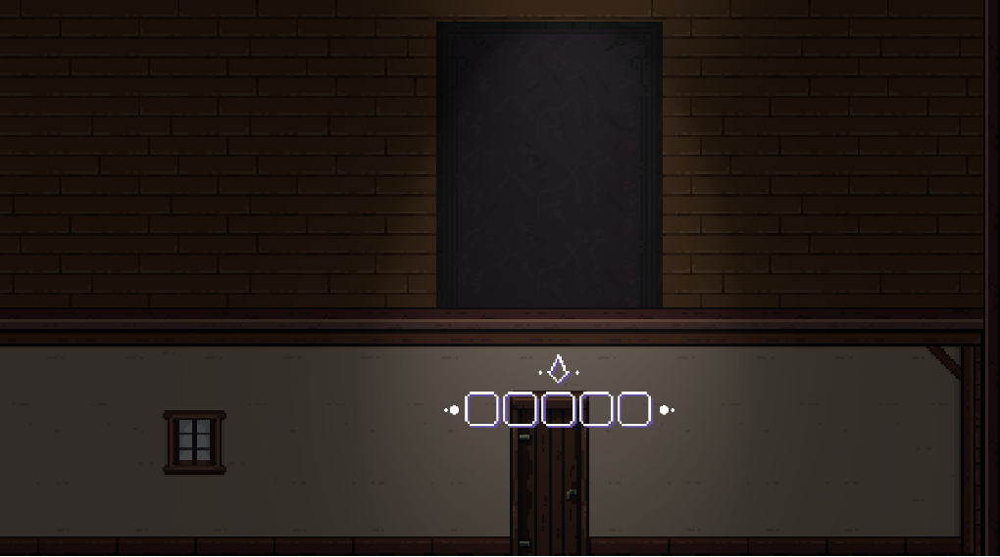
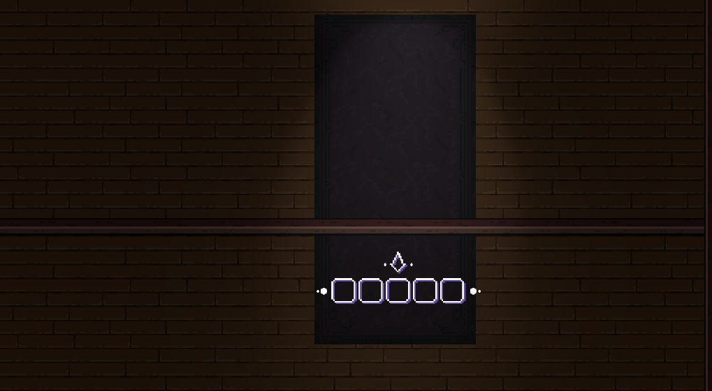

# Game Mechanics and Features

## Core Game Mechanics


Contents in this section are very outdated and will be revised later.


The game will have the following mechanics at a glance:

1 - Line of Sight (player view cone) 1.1 - The player will have a visual representation of their character's line-of-sight via the view cone, which looks like a flashlight, but it's just a visual indicator of what the player can see. 1.2 - Only the view area will be visible. Although the rest of the area is still visually shown, dynamic objects and other interests like other players or items will only be visible within the player's line-of-sight. 1.3 - There will be other objects that create light around a specified area that work similarly to character's line-of-sight. 1.4 - The character's line of sight will not be visible to the other players.

2 - "Soul Energy" 2.1 - The "Soul Energy" meter is essentially a character's health meter and stamina meter combined into one. 2.2 - Getting hit by an offensive object will decrease the character's "Soul Energy" meter. 2.3 - The "Soul Energy" meter will decrease when the player moves in any state (run, walk, sneak). Each movement state will have different decrease intervals to it. 2.4 - The "Soul Energy" meter is divided into two parts. The first part of it act as a "buffer", and will regenerate if the player stands still. 2.5 - The second part of the "Soul Energy" meter will start to be consumed instead when the first part gets empty. At this point, it will no longer regenerate when standing still. 2.6 - The second part of the "Soul Energy" meter will also slowly decrease over time. 2.7 - When the second part of the "Soul Energy" meter hits 0 after being attacked, the character dies. 2.8 - If it reaches 0 after decreasing over time, the player "looses control" of his character (essentially the same things as dying). 2.9 - The "Soul Energy" meter can be fully replenished by drinking a potion. 2.10 - Players can see their Soul Energy meter, but can not see the meter of other players. 2.11 - If the character's "Soul Energy" meter is below a certain amount, the player will hear and see soundwaves from random places while their vision starts to get darker. 2.12 - If the character's "Soul Energy" meter hits 0 after being attacked by another character, the character will die and drop their items on the ground. The character who killed them will have their stamina and sanity meters fully replenished. 2.13 - The "Soul Energy also very slowly decreases itself over time, as to encourage players to seek potions. If a character's sanity-meter hits 0 because of this effect, the player will loose control of his character, which has the same result of their character dying.

3 - Melee attack 3.1- Players can hit enemies by pressing the attack button. It's the most powerful attack in the game. 3.2- Hitting a character with a depleted sanity meter will kill them. 3.3 - if a melee attack does not kill the target, it will push the other character back and decrease their "Soul Energy" meter. 3.4 - If two characters hit themselves with melee attacks at about the same time, their attacks will be blocked, and both of them will be pushed back without loosing any "Soul Energy". 3.5 - A melee attack cannot bet blocked by characters who are hit from behind.

4 -Throwable Objects 4.1- Throwable objects are scattered throughout the map. Buildings almost always have items inside them. 4.2 - Characters will be able to pick them up and hold up to 4 items in their inventory. Slots are not stackable. 4.3 - Throwable objects will be categorized into two different types, offensive and evasive. 4.4 - Offensive throwables will decrease an enemy's sanity-meter, and may also do additional effects such as pushing them back. 4.5 - Evasive throwables are focused on utilities such as assisting the player in escaping dangerous situations, baiting other players to move to a particular location or affecting an enemy character movement. 4.6 - Each throwable objects will emit a soundwave to represent the landing position with a different wave radius.

5 - Surface Types 5.1 - Different surfaces will have different sound effects. 5.2 - Some surfaces will not generate any sound. 5.3 - There will be tile objects that will affect the player's character movement. For instance, a player may be unable to run on ice.

6 - Footprints 6.1 - Some surfaces will be able to leave a footprint when the player's character walks on it. 6.2 - The footprint will last forever until the player who left them is killed.

7 - Environmental Objects 7.1 - Environmental objects include Trees, Rocks, Bushes, Tall Grasses, Item Crates, etc. 7.2 - These Environmental objects will be imported as a prefab brush inside the Unity engine. 7.3 - There will be objects that illuminate the surrounding area like a torch or any other light source.

8 - Player Movement 8.1 - Characters have three different movement states: Running, Walking and Sneaking. 8.2 - Each movement state will have different speeds attached to it. 8.3 - Sneaking will not generate any soundwaves for most surfaces, while the other modes will.

9 - Player Characters 9.1 - There are multiple player characters. Players can choose their character while in the lobby waiting for the game to start. 9.2 - Characters cannot be changed during the game. 9.3 - The player's character will have no effect in gameplay. 9.4 - Each character in the game will have different visuals, particle effects, animations and footprints.

10 - Win condition 10.1 - When only three players are left, a countdown of 5 minutes will start. 10.2 - If only one character is left alive before the countdown ends, they will be the winner. 10.3 - Otherwise, the player with the most "Soul Energy" left will be the winner. 10.4 - If more than one player have the same amount of "Soul Energy", draw conditions will be implemented. 10.5 - All of the other players will be ranked below the winner, and their place will be corelated to how much they had survived.

## Detailed Mechanics

### "Soul Energy" meter behaviour

The player's entire soul energy meter will have a maximum of X, and the default movement degradation will be 5 in n seconds for movement state Y. The countdown will start before the stamina value is reduced.

* Walking -> decreases "Soul Energy" by 5 for every 3 seconds.
* Running -> decreases "Soul Energy" by 5 for every second.
* Sneaking -> decreases "Soul Energy" by 5 for every 5 seconds.

The degradation timer will not reset when the player's state changes. Instead, the new decrease rate will apply to the existing counter. For example, suppose the player was sneaking for 4 seconds and started to walk before the 5-second mark. In that case, the timer will not reset, but instead, check if the current countdown is above the current state's degradation rate and decrease it accordingly. The timer will reset after when the player's stamina has been reduced. Staying idle for 5 seconds will start to increase their "Soul Energy" by 5 every second. However, the "Soul Energy" meter won't passively regenerate if it gets below Z (second part of the meter). However, the player can still run or walk even if it's 0. Every throwable object (or its bonus effects) will have an attack value to it. Being in the area of effect will decrease the player's "Soul Energy" meter by the object's attack value.The character's Soul Energy will also slowly degrade, in a rate equivalent to the player's movement state. The main intention is to encourage players to find more potions, while not incentivizing them to start running arround whenever their Soul Energy level is high. When the sanity-meter is low, it will affect what the player sees and hear. The following are the "Energy meter" values and their debuffs: Below X (second part of the meter) -> Reduce the player's field of view and visually makes the ambient darker. Below Y-> spawn random footstep sound effect with the soundwave outside of the player's view. Below Z (almost empty)-> The player cannot run, and the screen visually gets even darker. Killing another player or drinking a potion can replenish the player's "Soul Energy" meter. After a certain amount of time since the match has started, more potions will start spawning in locations far from the players.

### Melee attack

Attack action and collision: When a player presses the attack button, an attack animation will play throughout the entire attack duration. The attack motion should not be longer than 2 seconds. The attack collider will be set to follow the crystal as the attack animation plays. In terms of system mechanics, this is similar to that of swinging a sword. Players can walk while attacking. However, they won't be able to run or crouch in this state.

Cooldown: At the end of an attack, the player will have 0.7 seconds (adjustable) of action cooldown. Players will not be able to trigger an attack during this interval.

Attack and block: When a player presses the attack button, either an attack or a block will occur, depending on the following circumstances:

1 - Blocking attack

* Condition: both characters are facing each other, and they attack at around the same time (time limit of 1.5).
* Effect: no damage to either of the players. Instead, both of them are pushed back 4 \~ 5 tiles away from each other.

2 - Sneak attack

* Condition: the player attacks an enemy character outside of the enemy's view angle.
* Effect: heavy damage plus pushes the receiving player.

Sneaking and then attacking other players from behind will be a core feature of the game, therefore, it requires rigid balancing. Attacking or blocking should feel natural and satisfying, meaning there shouldn’t be a moment where you are close to a player and nothing happens.

### Throwable objects

There will be multiple throwable objects that can be collected throughout the game. This will be categorized into two major types of throwables:

1 - Offensive:

* Rock: the most basic and common kind of throwable object. This will generate a small amount of noise when landed. If it hits another player; damage = 25.
* Slime Egg: very common, but less common than rocks. After it lands, it will bounce in the same direction it was thrown, generating soundwaves that simulate a player walking. If it hits another character;damage=20 and kockbacks the enemy.
* Exploding egg: rare item that generate an area of effect around where it lands, damaging players who stay inside each second; damage <= 40.

2 - Evasive:

* Trap rune: a very rare item that will spawn a trap area when it lands, which will not be visible for player who are too far away from it. Any character who walks over this stun rune will be in a stunned. However, characters can throw rocks or other objects into the area to trigger the trap as well. For every player inside the area of effect; canStun = true;
* Teleport Rune: a very rare item that will teleport the player to the landing point instantly. it will generate a sound (with sound waves) when the player is teleported. When thrown, the player will turn into light particles, and those particles will move to where the runestone has landed.

Every throwable object that can be thrown by a player and can hit a player will have the following properties:

* bool canStun - if true, players who are hit by this object will be slowed and unable to attack for a small period of time.
* float damage - the amount it will decrease the opponent's "Soul Energy" meter.
* Additional effects - other effects may include splash damage or changing the surface type. This part should be flexible.

## Environmental objects

These are static objects that are part of the map’s environment. Most of them will act as a hiding spot for the player. There will be two major types of environmental objects:

1 - Static:

* Trees
* Large furnitures (sofas, beds, bookshelf, etc)
* Buildings
* Campfires

2 - Dynamic (Interactive):

* Stack of books
* Doors

Static objects are game field objects that will be constant throughout the client application. Players can hide behind them but players will not be able to change the state of these objects. Dynamic objects are game field objects with their own state that is synced across different clients in the same stage. For example, if a player opens a door, he will be transported to the house's inside.

### Buildings

The game map will contain several buildings that the players can go inside without a loading screen. The buildings should be walled when the player is outside, but when the player is inside the walls will be hiden and the house interior shown. This process should happen dynamically and prevent buildings from having a loading screen. This can be achieved by placing the roof tileset in a separate grid and toggle them during runtime. All buildings will have only one accesible floor, and within it usually there will be with many obstacles that block the player’s line of sight (usually furniture), providing a certain sense of security. Most buildings will only have one entrance, which makes it the perfect camping spot for other players, also potentially being a good hiding spot too.

(Figure 1) Building before transition

(Figure 2) Building after transition

When the player enters a building, the game view will be slightly zoomed into the structure and all the outside environment will be darkened, out which will prevent the player from seeing the exterior while being inside a building. To allow space for the player to move, walls must need to be at least 3 tiles tall, since the character sprites occupy almost 2 tiles in height.
