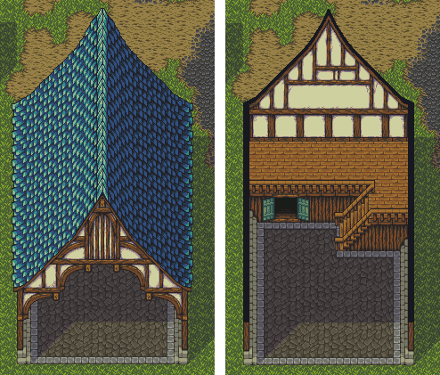

# Game Mechanics and Features

## Core Game Mechanics

The game will have the following mechanics at a glance:

1. Line of Sight \(player view cone\)
   1. The player will have a visual representation of their line-of-sight via the view cone, which looks like a flashlight, but it's just a visual indicator of what the player can see.
   2. Only the view area will be visible. Although the rest of the area is still visible, dynamic objects and other interests like other players or items will be visible within the player's line-of-sight.
   3. There will be other objects that create light around a specified area that work similarly to the payer's line-of-sight.
   4. The player's line of sight will not be visible to the other players.
2. Sanity-meter
   1. The sanity-meter is essentially the player's health value.
   2. Getting hit by an offensive object will decrease the player's sanity-meter.
   3. Sanity-meter can be replenished by drinking a potion.
   4. **Players will not be able to see their sanity-meter**.
   5. If the player's sanity-meter is below a certain amount, the player will hear and see soundwaves from random places while their vision starts to get darker.
   6. If the player's sanity-meter hits 0, they will be "exhausted," which means the player will become slow and heavy to control.
   7. The player cannot run while they are exhausted. If the player manages to catch another player while being exhausted, their sanity-meter and stamina-meter will be fully replenished.
3. Stamina-meter
   1. Stamina-meter will decrease when the player moves in any state \(run, walk, sneak\).
   2. Each movement state will have different decrease intervals to it.
   3. The stamina-meter can be replenished by either drinking a potion or by standing still for a certain duration.
   4. If the player's stamina-meter hits 0, the player will not passively regenerate their stamina.
   5. If the player's stamina-meter hits 0, their sanity-meter will passively decrease at every interval.
   6. Being hit by an offensive throwable object will not affect the player's stamina-meter.
4. Catching \(melee attack\)
   1. Players can catch other players by pressing the catch button \(left mouse button on PC\) while they are behind the other player.
   2. Players can only be caught if the other player's sanity-meter is below a certain amount.
   3. Catching another player with a high sanity-meter will push the other player back and decrease their stamina or sanity \(the stamina-meter acts as a protective layer in this case\).
5. Throwable Objects
   1. Throwable objects are scattered throughout the map. They are most commonly found inside village areas where there are many buildings.
   2. Players will be able to pick them up and hold up to 6 items in their inventory. Slots are not stackable.
   3. Throwable objects will be categorized into two different types, **offensive** and **evasive.**
   4. Offensive throwables will either decrease the other player's sanity-meter or make them exhausted for a short duration.
   5. Evasive throwables are focused on assisting the player in escaping dangerous situations or baiting other players to move to a particular location.
   6. Each throwable objects will emit a soundwave to represent the landing position with a different wave radius.
6. Runestones
   1. Runestones are a special type of a throwable object, as they carry magical properties that can be used once.
   2. The bonus effect of a runestone is different depending on the player's class.
   3. Currently, we have teleport runes and trap runes.
7. Surface Types
   1. Different surfaces will have different sound effects.
   2. Some surfaces will not generate any sound.
   3. There will be tile objects that will generate a sound even if the player is walking in sneak mode. \(For instance, broken glass on the floor\).
8. Footprints
   1. Some surfaces will be able to leave a footprint when the player walks on it.
   2. The footprint will last forever until the player is out of the game.
9. Environmental Objects
   1. Environmental objects include Trees, Rocks, Bushes, Tall Grasses, Item Crate, etc.
   2. These will be imported as a prefab brush inside the Unity engine.
   3. Most environmental objects will have animation or another special effect when they collider with the player object.
   4. There will be objects that illuminate the surrounding area like a torch or any other light source.
10. Player Movement
    1. Players have three different movement states; Running, Walking, Sneaking.
    2. Each movement state will have different speeds attached to it.
    3. Sneaking will not generate any soundwaves for most surfaces, while the other modes will.
11. Player Classes
    1. There are multiple player classes. Players can choose their character class before they join the game.
    2. Classes cannot be changed during the game.
    3. The player class will determine the bonus effect of a rune.

## Detailed Mechanics

### Stamina-meter degradation

The player's stamina-meter will have a maximum of 100, and the default degradation value will be 5 in `n` seconds for movement state `x`. The countdown will start before the stamina value is reduced.

* Walking -&gt; decrease the stamina by 5 for every 3 seconds.
* Running -&gt; decrease the stamina by 5 for every second.
* Sneaking -&gt; decrease the stamina by 5 for every 5 seconds.

The degradation timer will not reset when the player's state changes. Instead, the new decrease rate will apply to the existing counter.

For example, suppose the player was sneaking for 4 seconds and started to walk before the 5-second mark. In that case, the timer will not reset, but instead, check if the current countdown is above the current state's degradation rate and decrease it accordingly. The timer will reset after when the player's stamina has been reduced.

Staying idle for 5 seconds will start to increase their stamina-meter by 5 every second. However, the stamina-meter won't passively regenerate if it gets below 0. However, the player can still run or walk even if it's 0. Instead of decreasing the stamina, the player's sanity-meter will decrease based on the aforementioned degradation value.

### Sanity-meter behavior

The player's sanity-meter has a maximum value of 100. This value will not be visible to the player directly. Instead, the sanity-meter will affect what the player sees and hear.

Every throwable object \(or its bonus effects\) will have an attack value to it. Being in the area of effect will decrease the player's sanity-meter by the object's attack value.

If the stamina-meter is below 0, the sanity-meter will start to decrease by one, every second. The degradation rate will be affected by the player's movement state, but it will not passively regenerate. However, if the player's stamina-meter is replenished, the sanity-meter will not passively decrease.

Sanity-meter value and their debuffs:

* 40 ~ 20 -&gt; make the area outside of the player's field of view darker. Below 20 means pitch dark.
* Below 30 -&gt; become catchable \(game over when caught by another player\).
* Below 20 -&gt; spawn random footstep sound effect with the soundwave outside of the player's view.
* 0 -&gt; The player cannot run, and the default walking speed is decreased by half. The view control \(player rotation\) will be slightly slow.

Catching another player or drinking a potion can replenish the player's sanity and stamina-meter. The sanity-meter is effectively the player's health value.

Because the player does not die even if both of their meters are zero, the map will ensure that there will be at least five potions spawned somewhere.

### Catch/melee attack

Catching is one of the most integral parts of this game. In the lore, catching is described as the player swinging a crystal that can capture a person's soul.

A player can only get a game over when another player catches them under a specific condition. There are roughly three types of 'catching' that a player can trigger by pressing a dedicated action button \(the catch button\). Because the result of a catch action is different from situation to situation, it may be more accurate to describe this action as a melee attack rather than just a catch.

**Attack action and collision:**

When a player presses the catch button, an attack animation will play throughout the entire attack duration. The attack motion should not be longer than 2 seconds. The player hitbox is an oval shape that covers the whole player sprite. The attack collider will be set to follow the crystal as the attack animation plays. In terms of system mechanics, this is similar to that of swinging a sword. Players can walk while attacking. However, they won't be able to run or crouch in this state.

**Cooldown:**

At the end of an attack, the player will have 0.7 seconds \(adjustable\) of action cooldown. Players will not be able to trigger an attack during this interval.

**Attack and damage types:**

When a player is attacked, the effect will differ depending on their status and the hit location. There are three different types of attacks.

* Defensive push
  * Condition: both the attacking and the receiving players are within their view angle \(i.e., facing each other\).
  * Effect: no damage to either of the players. Instead, both of them are pushed back 4 ~ 5 tiles away from each other.
* Sneak attack
  * Condition: the player attacks someone with a sanity value above the damage threshold while being out of their view angle \(i.e., attacking a healthy player from the back\).
  * Effect: heavy damage plus pushes the receiving player.
* Catch
  * Condition: the player attacks someone with a low sanity value while being out of their view angle.
  * Effect: the receiving player will get a game over The primary purpose of pushing the player after each blow is to ensure that they have a window of opportunity to run away.

### Throwable objects

There will be multiple throwable objects that can be collected throughout the game. This will be categorized into two major types of throwables:

* Offensive:
  * Stones: the most basic and common kind of throwable object. This will generate a small amount of noise when landed. If it hits another player. `damage = 15` `canStun = true`
  * Shock bomb: upon landing, this object will have an area of effect in the radius of r. For every player within the explosion radius; `damage = 10` `canStun = true`
  * Trap rune: a rune stone that will spawn a trap area when it lands. This is basically a stun trap that can be set by the player. Any player who walks over this stun rune will be in a stunned state. However, players can throw rocks or other objects to trigger this as well. For every player inside the area of effect; `damage = 45` `canStun = true`
* Evasive:
  * Bouncing Inflatable Toads: Similar to stones, it will generate a sound when it lands, but one notable difference is that bouncy objects will bounce and generate a stream of sounds that mimics a player’s walking footsteps that is moving forward.
  * Slime Ball: a slime ball will not generate any sound waves when it lands. If the slime ball hits a player, that player will be covered in slime and their movement speed will decrease by 70% \(both walking and running\) for 10 seconds. If a slime ball hits the ground, it will create a slime puddle that will decrease any player who walks on top of it by 60% but the slime will not stay on the player. The slimly surface will stay there permanently throughout the stage and it will leave a footprint of whoever walked on it.
  * Teleport Rune: a rune stone that will teleport the player to the landing point instantly. These are quite rare, and it will generate a sound \(with sound waves\) when the player is teleported. When thrown, the player will turn into light particles, and those particles will move to where the runestone has landed.

Every throwable object that can be thrown by a player and can hit a player will have the following properties.

* `bool canStun` - if true, players who are hit by this object will be stunned for `damage * 0.1` seconds.
* `float damage` - the amount it will decrease the opponent's sanity-meter.
* Additional effects - other effects may include splash damage, changing surface type, or changing effects depending on the player's character class. This part should be flexible.

### Environmental objects

These are static objects that are part of the map’s environment. Most of them will act as a hiding spot for the player.

There will be two major types of environmental objects:

* Static
  * Rocks
  * Bushes
  * Trees
  * Large furniture like sofa, bed, bookshelf, etc.
  * Buildings
  * Campfire
* Dynamic \(Interactive\)
  * End table
  * Candle/torches
  * Stack of books
  * Puddle
  * Item crates
  * Doors

Static objects are game field objects that will be constant throughout the client application. Players can hide behind them but players will not be able to change the state of these objects.

Dynamic objects are game field objects with their own state that is synced across different clients in the same stage. For example, if a player touches a stack of books on the map, that book will fall down generating a sound ripple. The stack of books will change its sprite to be a fallen stack of books which will also appear the same to other players as well, acting as an indicator that a player was here.

### Buildings

The game map will contain several buildings that the players can go inside without a loading screen. The buildings should be walled when the player is outside, but hides the walls and shows the interior when the player is inside.

Buildings will be one layer tall at max, meaning that it will not have any third floors. Instead, the first and second floors can be big with many different rooms of obstacles that block the player’s line of sight. Most buildings will only have one entrance, which makes it the perfect camping spot for other players, but potentially making it a good hiding spot too.

Buildings will be walled from the outside, but the walls and the roof will disappear when the player is inside. This process should happen dynamically and prevent buildings from having a loading screen. This can be achieved by placing the roof tileset in a separate grid and toggle them during runtime. The game view will be slightly zoomed into the building and all the outside environment will be darkened out which will prevent the player from seeing the outside environment while being inside a building.

The interior will be populated with various furniture and item crates that allow the player to have a false sense of security.

Because the player sprite is 32x60 pixels big, building walls and cliffs must be at least 2 or 3 tiles tall.

