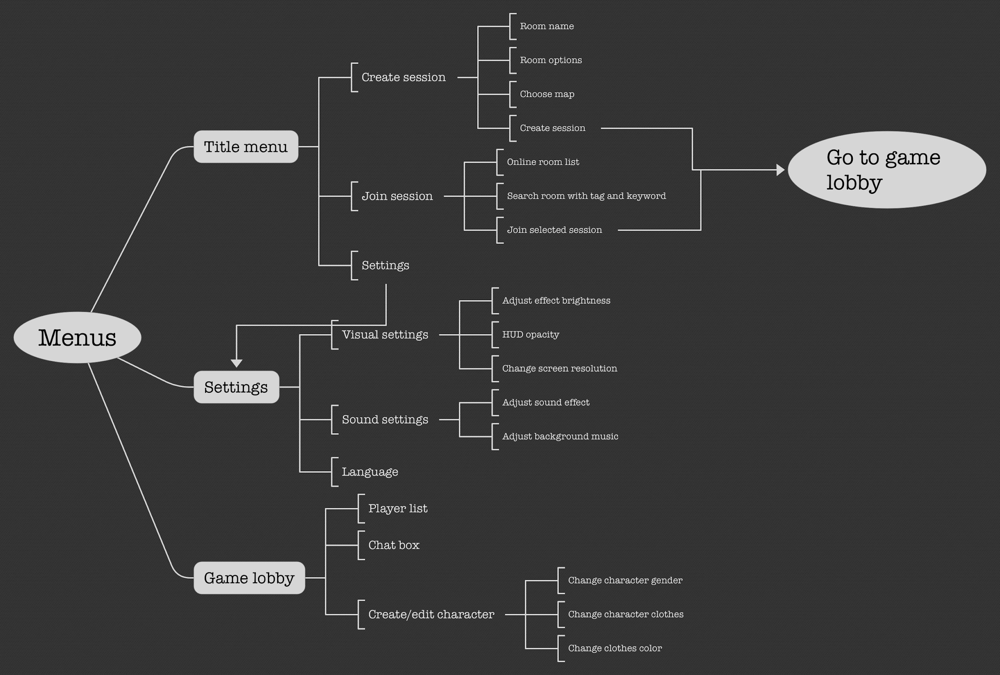

# Interface and Menus

## HUD Components

In-game HUD elements \(excluding mobile control HUDs\):

* Player current stamina value \(bar\)
* Open menu \(button\)
* Current players \(number\)
* Inventory slots

## Game Menus

The overall menu structure is like the following:

The title menu will be the entry point of the game.

Title menu:

* Create session
* Join session
* Settings
* Exit game

Create session:

* Set room name
* Set room options
  * Can chat -&gt; boolean
  * Session duration -&gt; time in minutes \(min: 10 max: 30\)
  * Has password -&gt; room password
* Choose map
* Create session button -&gt; go to session lobby

Join existing session:

* Currently online room list
  * Room name
  * Room members
  * Room options
  * Map name
* Search room
  * Search with keywords
  * Search with tags
* Join selected room button -&gt; go to session lobby

Settings:

* Visual settings
  * Adjust effect brightness
  * HUD opacity
  * Change screen resolution \(only for PC\)
* Sound settings
  * Adjust sound effect volume
  * Adjust background music volume
* Language \(optional implementation\)

Session lobby:

* Player list
* Chatbox
* Create/edit character

