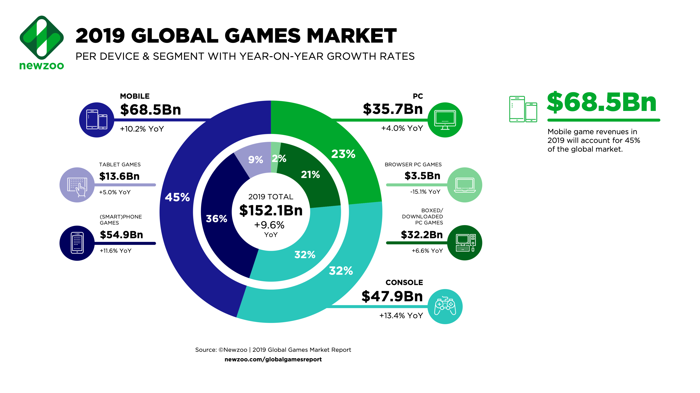

# Marketing Strategy

## Marketing Keywords

To form a solid marketing strategy for any project, we must first define what the project will be in terms of market data.

Witch One is an **indie slow-paced** 2D **online battle-royal** catch game that is focused on stealth, strategy with some action. This project aims to launch on platforms that have great **accessibility** bush as mobile devices and browser applications. We expect the majority of the players to be in the **niche** category.

## Target Market

### Target Audience and Region

The main target audience will be casual gamers who want games with less commitment, no login, quick enjoyment, and a low learning curve. The estimated market age will be from **ages 10~15** and **30~40**. A single game stage is designed to last around 20 minutes to 30 minutes, so people with free time to kill in random situations \(at least half an hour of waiting time\) will benefit from this game.

In 2019, the U.S. has become the \#1 Games Market \([newzoo, 2019](https://newzoo.com/insights/articles/the-global-games-market-will-generate-152-1-billion-in-2019-as-the-u-s-overtakes-china-as-the-biggest-market/)\), so this project will set the **United States of America** plus **other native English speaking regions** as it's target market.

### Target Platforms

Witch One by design is a cross-platform game, so the development team will always be prepared to port to another platform when they are given the chance. However, for the first few months of Witch One's lifespan, it will focus on being a **Browser-based** and **downloadable PC game** \(via itch.io and our own homepage\). According to newzoo, browser-based games have a humble market share of $3.5Bn \(2% of the PC game market\) and it is currently in a decreasing state while every other platforms are growing its market share. Witch One will **target the niche market** for the first few months and once it has gathered a sizeable amount of players, we will add additional features to the game and attempt to branch out to different platforms such as **handheld mobile platforms** within the first year of its release. This means that once we are prepared to release for mobile, the target market will shift **from niche to the casual market**.

## Marketing Strategies

### Word of Mouth

During the _initial phase_ of the game, our audience will be in the niche category, therefore we will rely on word of mouth as our marketing strategy with a near-zero marketing budget. This strategy will not gather a large number of players and we are not expecting to hit it big for the first fiscal year.

The word of mouth strategy is mostly for gathering a dedicated community and a userbase that will provide the team with valuable feedback and criticism for us to improve the game.

1. Announce the release of Witch One to indie game communities on Reddit or other indie game forums as a public beta.
2. Create a Discord server about the game.
3. Have active interaction with the players and form a community.
4. Update the game according to the user feedback.
5. Attract new players through word of mouth

We expect to slow create a game that many people will like through this process and eventually have a full release of the game through Steam on PC.

### Viral Marketing

Witch One does not have a campaign mode or an offline mode, meaning that there will be no upfront story that is presented to the user. Instead, the story of the game will be presented through the game environment \(map\) itself. The game's lore will only be told through placements of game objects inside the map and heavily utilize the environmental storytelling method. Players are encouraged to piece the story themselves.

We can think of two possible viral marketing opportunities from here:

* User-generated content that theorizes about the Witch One's story
* Recording \(or live streaming\) of Witch One's unpredictable gameplay

#### Artificially Going Viral

Due to the laws of malicious compliance of the internet, any program or event that aims to make a product go viral has a good chance of backfiring. So _it is not recommended to take these actions_, but there is a slim chance that it may work.

1. incentivize user-submitted content
2. in-game rewards for sharing the game via SNS
3. pay streamers to play the game
4. give rewards to people who have correctly theorized about the game's story

