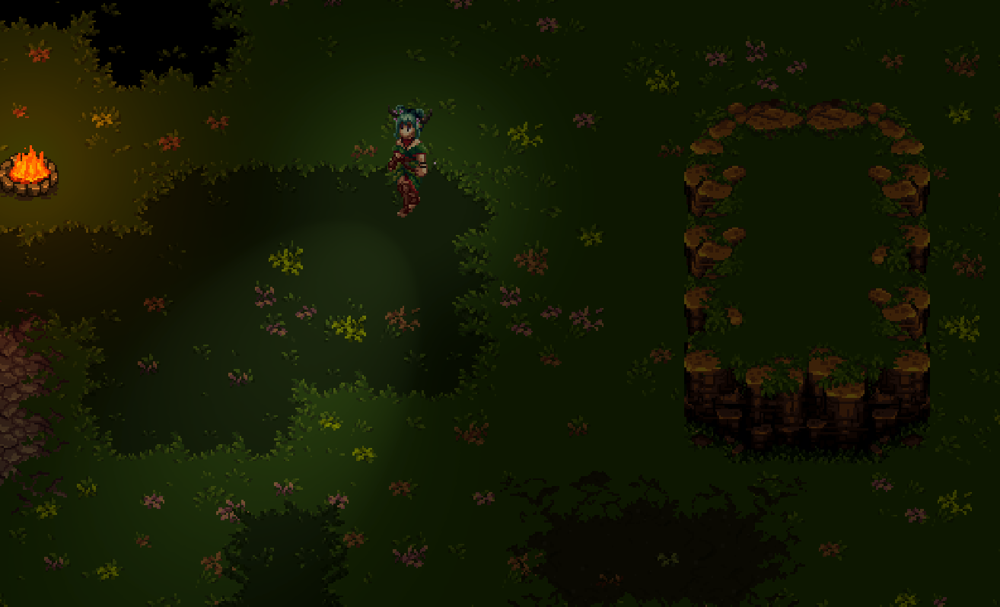
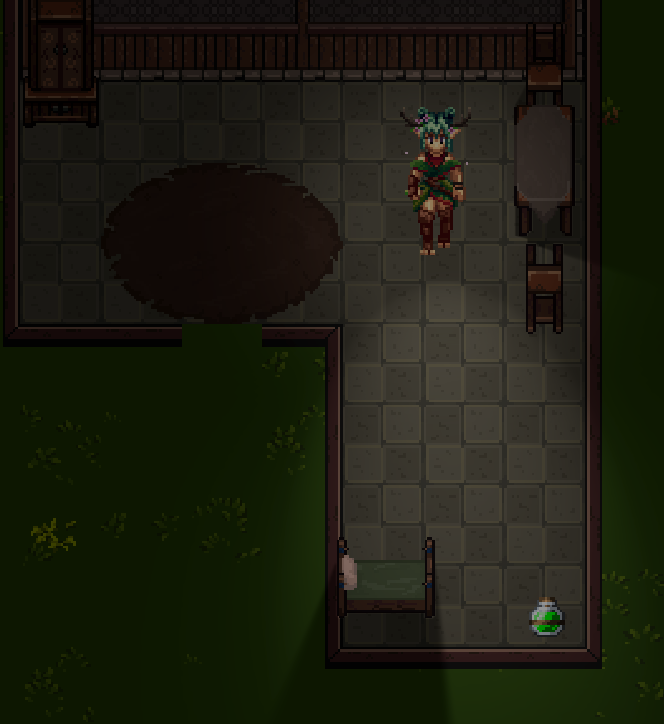
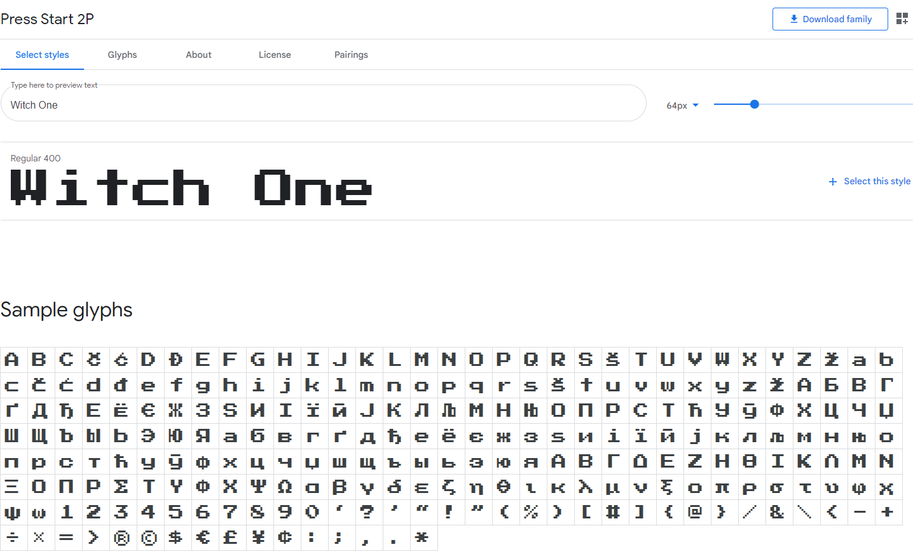
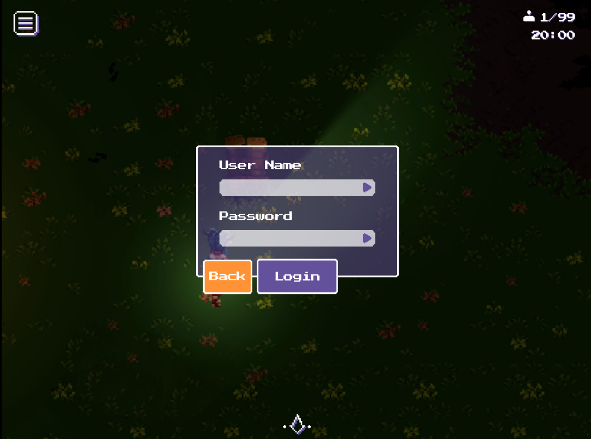
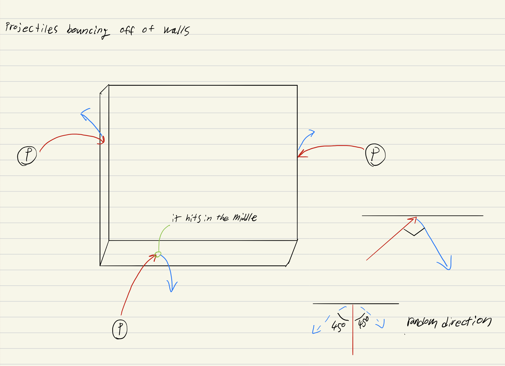
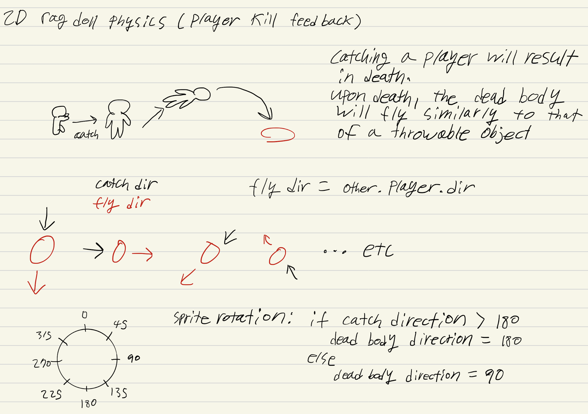
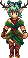
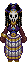
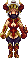

# Visual Design

## Graphics

Witch One will have a top-down orthogonal perspective \(ex: Legend of Zelda\) with 2D sprites to represent the environment. The game will use a lot of dynamic lighting effects as it is part of the core gameplay. There will be slight animations for a few environmental objects, such as trees for example.

\(Figure 1\) Art style and perspective

\(Figure 2\) Interior design

For the art style, a single tile will be 32x32 pixels big while the player will be 32 wide and 60 pixels tall. The world unit is 32 pixels. The throwable and consumable objects should fit this proportion and make be smaller than 32x32 pixels. Furthermore, Witch One must follow the following color palette for both the character and prop sprites.

\(Figure 3\) Sprite color palette

A single component of an asset \(such as metal, gold, cloth, etc.\) should be within 2 variations of light to dark palettes/color. More can be added later but the main idea is that an object \(e.g a wooden barrel\) should use similar wood colors as the trees in the environment.

## Visual Themes

Maps will have the following themed areas and world types:

* Swamp Area
* Shadowlands
* Grasslands
* Desert Area
* Snow area
* Cave area
* Villages
* Castle interior
* Dungeon interior

For the overall visual theme, the game will have a medieval aesthetics \(castles, village houses, torches, etc.\). One map may have multiple biomes, and each one might have many areas with different sections and themes. For example, the grassland biome may be divided into forests with many trees , fields with short vegetation, and bush areas surrounding rivers. While multiple areas with different biomes are not necessarily required, all maps should have areas with differences \(even if small\) in gameplay, otherwise the map will be dull. The biomes are generally a visual thing and may not be related to such gameplay differences between the areas of the map. Some exceptions are places that thematically have trees, houses or ice.

## Fonts

In-game fonts have squared edges, in such a way they feel slighty of arcade games but are still clear and legible. Currently, we are using Press Start 2P \([https://fonts.google.com/specimen/Press+Start+2P?query=+Press+Start+2P](https://fonts.google.com/specimen/Press+Start+2P?query=+Press+Start+2P)\). Some text may be written using hand-written fonts or fonts that resemble a "magical feeling" \(this specially applies to text that is supposed to be written by characters of the in-game lore, such as a letter's content\). However, if this project is to have multi-language support, we will have to find different fonts for each language.

\(Figure 4\) "Press Start 2P" font example and available glyphs

## HUD Design

The menu HUD will be mostly composed of high contrast colored buttons and panels with pixelated fonts. The control and interface icons will resemble "magical symbols" in appearence, besides also being pixelated and having squared edges \(they must also have colored outlines to stand out from the game scene\). The colors will mostly be shades of purple and white, which are thematically the main colors of the game, and also orange colors, since they are complementary to purple.

\(Figure 5\) Game Login menu and HUD interface \(timer, player count, hamburguer menu icon\)

## Physics

Witch One is a top-down 2D game, so all the visible physics will be simulated physics and behave to imitate the real one. No particular mechanics are revolving around physics as physics is only a method to provide feedback to the users, therefore being part of the visual aspect rather than a game mechanic. The only exception is when players are knocked back by attacks, but in this case they will always be pushed the same amount of tiles in distance. Throwable object arc: Throwable objects will create an arc when it is thrown. The same arc will be applied but reflected when it hits a wall in case the object can bounce, otherwise it will just stick to the wall. The velocity an object may bounce will be the same as the one used then it's thrown.

\(Figure 6\) How bouncing objects should bounce off the walls

Player death ragdoll: When a player is killed by being hit with a melee attack or a throwable object, the dead player’s body will be slighty pushed away and give a ragdoll-like effect. The sprite itself may not change too much and there are no actual “raggy” effects to the sprite \(as we do not use Tween animations\) but the sprite will just be rotated so it looks like it’s lying down and be “thrown away” like the throwable object motion. At the place in which the body ends up lying, an animation containing the player's spirit will play.

\(Figure 7\) player bounce-off impact direction \(the term "catch" is now outdated\)

## Player Character

The player character will be an 8-directional 32bit pixel sprite. There will be different player classes with different footprints and skins, but each character's components will not be customizable \(excluding the color\) and all player characters will be female. The classes will be chosen from the following archetype list:

* Shadeboi \(regular novice shadow\)
* Regular novice \(think shade without gloves and normal skin color as a base character\)
* Wicca \(good-natured witch like a druid\)
* Exorcist \(a priest with magic powers 😉 \)
* Bruja \(Latina witch uses charms\)
* Timebender \(wizard that can forward or reverse time\)
* Demona \(witch using hell as a source of power\)
* Jinn \(evil spirit from the Muslim world\)
* Sangoma \(south African witches/healers\)
* Skinwalker \(Navajo witch that can turn into animals\)
* Kitsune-mochi \(fox spirits known for witchcraft in Japan\)

Due to our limited development schedule, the initial game will only focus on implementing three classes, each one having either no skins or only a single one, but the game will gradually add more skins and classes. Character proportions will look like the following:

Characters will have multiple motion states, actions, and directions for each state.

### Animation types:

#### Motion:

* Looping animation

#### Action:

* Linear animation
* Triggers or certain conditions

### Character action sate:

* Idle
* Attack \(stabbing with a crystal\)
* Dead \(no animations, only two directions of the character laying down\)
* 8 view directions, and 3 \(or more\) frames of animation for each state. There may also be aditional small animations that might play when the character is not dead, such as ocasionall small particles to indicate magic.

\(Figure 11\) Player character sprite directions

## Items

Item sprites may have different variants that are randomized but will not have directional animations. Items can have looping animations or linear animations \(non-loop\) that play depending on the state of the item. Using an item can be followed by a special visual effect that can be triggered based on the item state. The visual effect will be considered as a separate asset.

### Item types:

* Throwable
* Consumable

### Trigger Moments \(Item State\):

#### Common:

* Field \(in-game world\)
* Can have a looping animation or effect

  -Inventory Slot

  -Cannot have any animation

#### Throwable Items:

* Mid-Air \(thrown\)
* Can have a looping animation or effect
  * On-Ground \(landed\)
  * Can have a looping animation or effect
  * Trigger Item Effect

        -This can be triggered as soon as the item lands or after a certain condition \(ex: if a player collides with the item\)

        -Can have a looping animation or effect

        -Can have a linear animation or effect

#### Consumable Items:

* Post-Consumption
* Can have a linear effect
* Cannot have any animation

