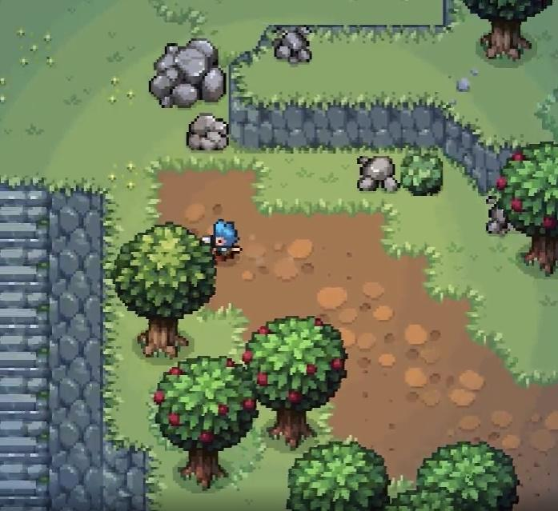
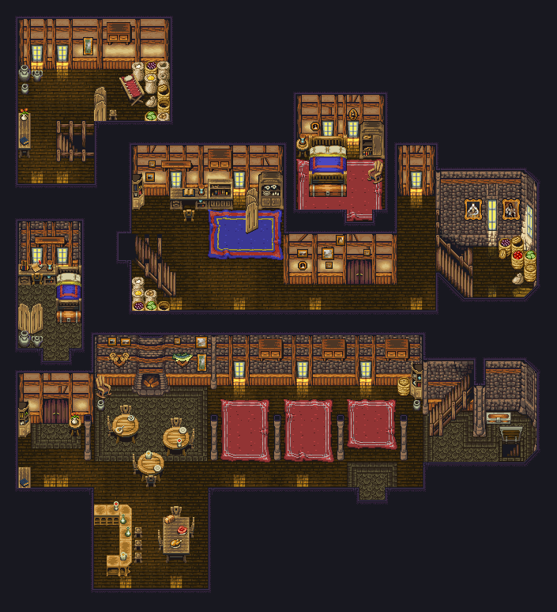
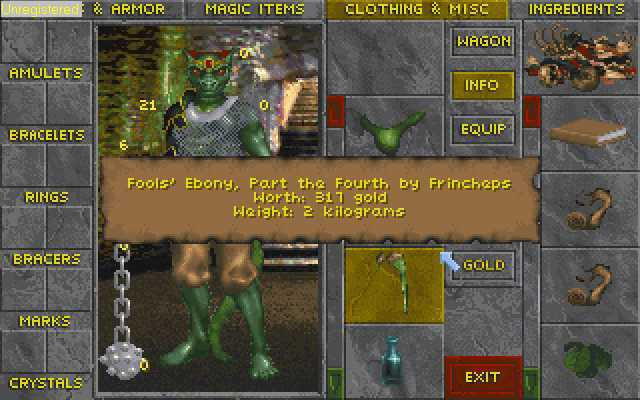
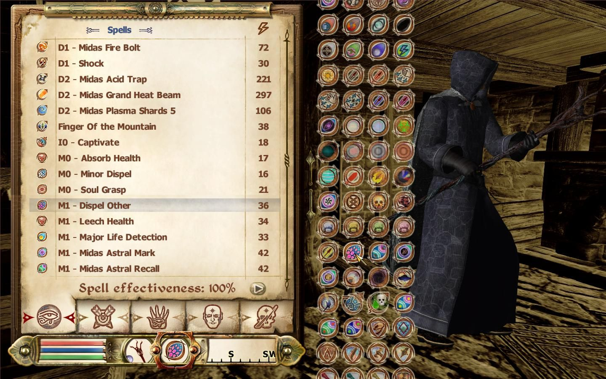
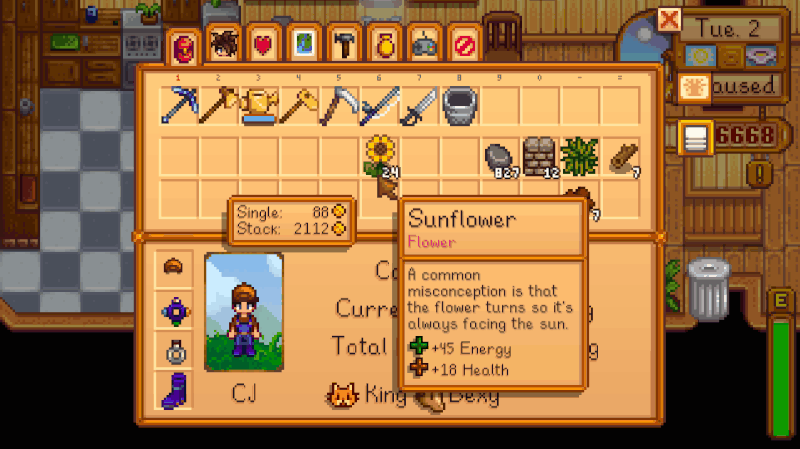
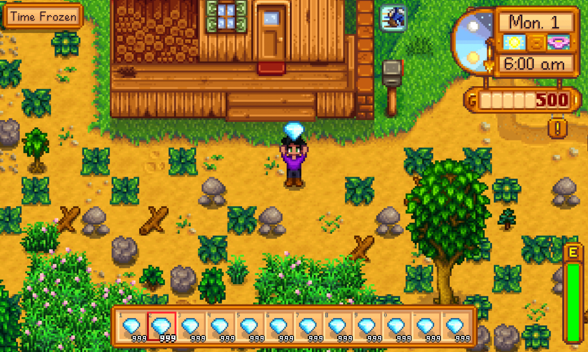
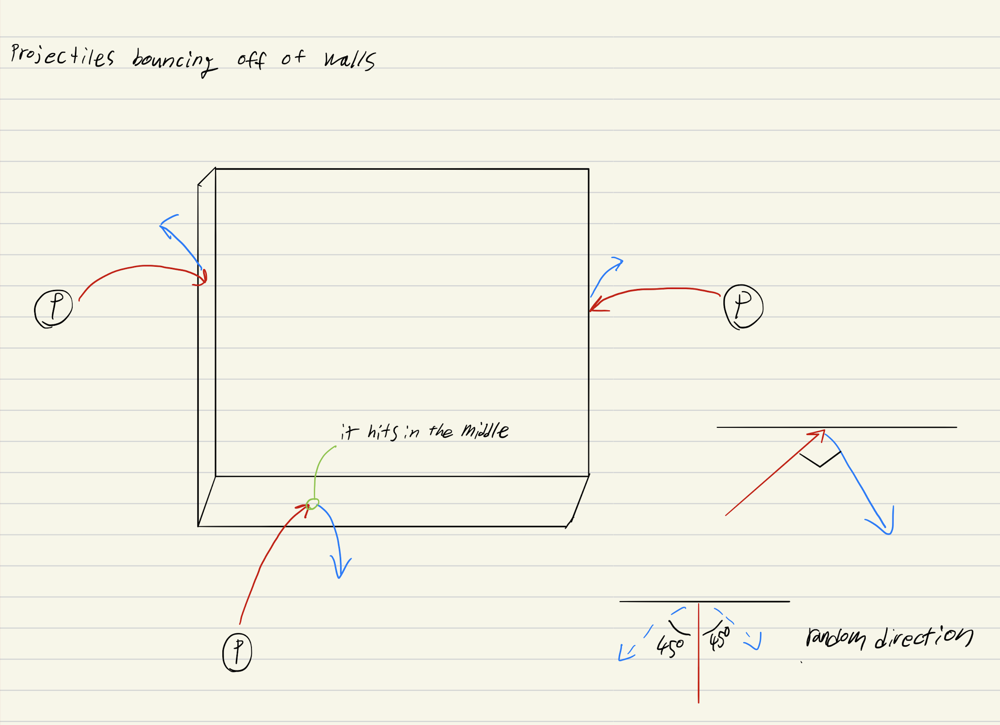
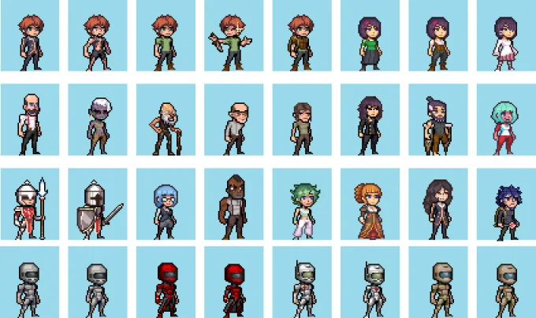
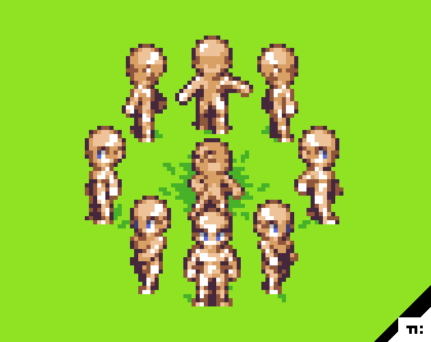

# Visual Design

## Graphics

Witch One will have a top-down orthogonal perspective \(ex: Legend of Zelda\) with 2D sprites to represent the environment. The game will use a lot of dynamic lighting effects as it is part of the core gameplay. There will be slight animations for environmental objects such as trees, grasses, and bushes moving with the wind.

For the art style, a single tile will be `32x32` pixels big while the player will be 32 wide and 60 pixels tall. The world unit is 32 pixels. For other throwable objects, they should fit this proportion and make them smaller than 32x32 pixels.

Furthermore, Witch One must follow the following color palette for both the character and prop sprites.

A single component of an asset \(such as metal, gold, cloth, etc.\) should be within 2 variations of light to dark palettes/color. Feel free to add more but the main idea is that for artists to make an object \(e.g a wooden barrel\), it should use the same wood colors as the trees in the environment.

## Visual Themes

Maps will have the following themed areas and world types

* Swamp Area
* Underground Dungeon/Ruin Area
* Grasslands
* Desert Area
* Snow area

For the overall visual theme, the game will have a medieval aesthetics \(castles, village houses, torches, etc.\).

One map will have one biome but contain multiple sections and themes. For example, a snow map can contain urban areas, rough wilderness, abandoned campsites, etc. but all of this should contain snow in some way.

The biomes are generally a visual thing as they do not have any gameplay changes.

## Fonts

In-game fonts can have a hand-written feel. Like an etching on a runestone or carefully written on a Pyperus paper. [Just Me Again Down Here](https://fonts.google.com/specimen/Just+Me+Again+Down+Here?preview.text_type=custom&category=Handwriting) or [Reenie Beanie](https://fonts.google.com/specimen/Reenie+Beanie?preview.text_type=custom&category=Handwriting) is a good example. Alternatively, the game can use a pixelated font rather than a styled font or a mixture of both.

However, if this project is to have multi-language support, we will have to find different fonts for each language.

## HUD Design

\[note: this part is outdated, please update this\]

The interface design will have a pixelated look to it that complements the game’s visual theme of a magical medieval battle between witches. The look will be a cross between Stardew Valley and The Elder Scrolls series \(2 and 4 to be precise\).

The UI sprites will also be a 32-bit pixel sprite.

### UI Component Designs

The following objects will be used for the game UI design:

* Scroll or a Papyrus paper =&gt; large surface panels or menu background
* Runestone with a glowing icon =&gt; buttons
* Flag banner =&gt; buttons
* Hourglass =&gt; time indicator
* Gems =&gt; on-screen controls

## Physics

Witch One is a top-down 2D game, so all the visible physics will be simulated physics and behave to imitate the real one. No particular mechanics are revolving around physics as physics is only a method to provide feedback to the users. Therefore, it is part of the visual aspect rather than a game mechanic.

1. **Throwable object arc**: Throwable objects will create an arc when it is thrown. The same arc will be applied but reflected when it hits a wall. The velocity will not change when this happens. Additionally, objects should be throwable on top of cliffs to a surface below without hitting the wall collider, but not vice versa.

1. **Player death ragdoll**: When a player is caught \(dead\), the dead player’s body will be pushed away and give a ragdoll-like effect. The sprite itself may not change too much and there are no actual “raggy” effects to the sprite \(as we do not use Tween animation\) but the sprite will just be rotated so it looks like it’s lying down and be “thrown away” like the throwable object motion.

## Player Character

The player character will be an 8-directional 32bit pixel sprite. There will be different player classes with different skins, but each player’s components will not be customizable \(excluding the color\) and all player characters will be female. The classes will be chosen from the following list:

* Shadeboi \(regular novice shadow\)
* Regular novice \(think shade without gloves and normal skin color as a base character\)
* Wicca \(good-natured witch like a druid\)
* Exorcist \(a priest with magic powers ;\) \)
* Bruja \(Latina witch uses charms\)
* Timebender \(wizard that can forward or reverse time\)
* Demona \(witch using hell as a source of power\)
* Jinn \(evil spirit from the Muslim world\)
* Sangoma \(south African witches/healers\)
* Skinwalker \(Navajo witch that can turn into animals\)
* Kitsune-mochi \(fox spirits known for witchcraft in Japan\)

Due to our limited development schedule, the initial game will only focus on implementing three classes with only one skin to choose from, but the game will gradually add more skins and classes.

Character proportions will look like the following:

Player movement state:

* Walking
* Running
* Crouching
* Heavily wounded \(slowly moving, used when the player has a low sanity-meter\)

Player action sate:

* Idle
* Attack \(stabbing with a crystal\)
* Dead \(no animations, only two directions of the player laying down\)
  * fall down sideways
  * fall on their back

8 view directions, and 3 \(or more\) frames of animation for each state.

